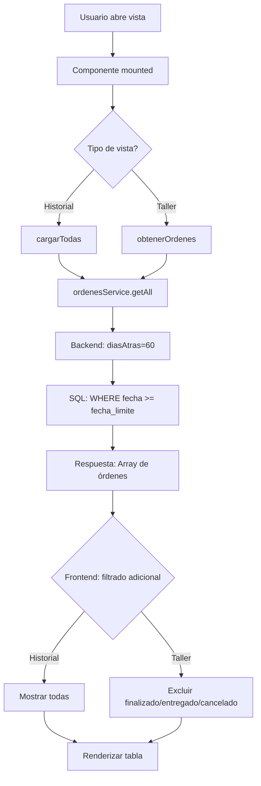
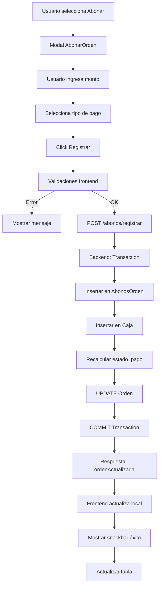
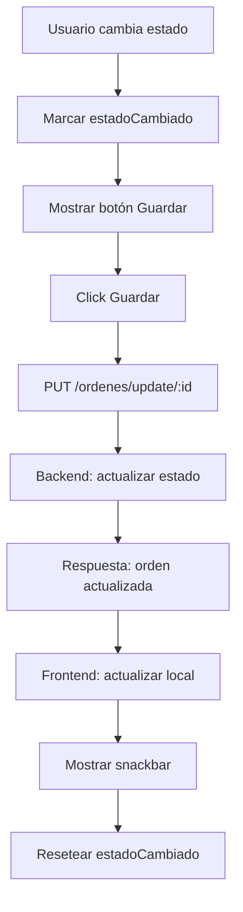

# Contexto del Proyecto - Módulo de Órdenes y Pagos

**Fecha de actualización:** 30 de diciembre de 2025  
**Sistema:** ServiCopias - Sistema de Gestión de Órdenes  
**Framework:** Vue 3 (Composition API) + Vuetify 3

---

## 📋 Tabla de Contenidos

1. [Arquitectura General](#arquitectura-general)
2. [Componentes Principales](#componentes-principales)
3. [Servicios y API](#servicios-y-api)
4. [Composables](#composables)
5. [Flujo de Datos](#flujo-de-datos)
6. [Funcionalidades Implementadas](#funcionalidades-implementadas)
7. [Optimizaciones de Rendimiento](#optimizaciones-de-rendimiento)

---

## 🏗️ Arquitectura General

### Estructura de Carpetas
```
Frontend/src/
├── components/
│   ├── ordenes/
│   │   ├── ListaOrdenes.vue          # Historial completo con búsqueda avanzada
│   │   ├── OrdenDetalle.vue          # Modal de detalle de orden
│   │   └── AbonarOrden.vue           # Formulario de registro de abonos
│   ├── taller/
│   │   ├── ordenTaller.vue           # Vista de producción/taller
│   │   └── OrdenItemsmodal.vue       # Modal de items de orden
│   ├── caja/
│   │   └── AbonarOrden.vue           # Componente de registro de pagos
│   └── composables/
│       ├── useBusquedaOrdenes.js     # Lógica de búsqueda y filtrado
│       └── useTallerOrdenes.js       # Lógica del módulo de taller
├── services/
│   ├── ordenes.service.js            # Servicios HTTP para órdenes
│   ├── abonos.service.js             # Servicios HTTP para abonos
│   └── api.service.js                # Cliente HTTP base
└── views/
    ├── Ordenes.vue                   # Vista principal de órdenes
    └── Taller.vue                    # Vista principal de taller
```

---

## 🧩 Componentes Principales

### 1. **ListaOrdenes.vue**
**Propósito:** Gestión completa del historial de órdenes con búsqueda avanzada

**Características:**
- ✅ Sistema de filtros por chips (Todas, ID, Cliente, Fecha, Rango)
- ✅ Búsqueda por múltiples criterios
- ✅ Paginación integrada
- ✅ Visualización con iconos de estado
- ✅ Acciones: Ver detalle, Abonar, Entregar
- ✅ Exportación a PDF
- ✅ Integración de datos de cliente (nombre + teléfono + NIT con iconos)

**Filtros Disponibles:**
| Tipo | Campos | Descripción |
|------|--------|-------------|
| `todos` | - | Muestra todas las órdenes (últimos 60 días) |
| `id` | ID de orden | Búsqueda directa por número de orden |
| `cliente` | Nombre + NIT | Búsqueda por datos del cliente |
| `fecha` | Fecha específica | Órdenes de una fecha exacta |
| `rango` | Fecha inicio/fin + Estado + Estado Pago | Filtrado avanzado multi-criterio |

**Estados de Orden:**
- 🟠 `pendiente` - Orden creada, esperando proceso
- 🔵 `en proceso` - En preparación
- 🟣 `en produccion` - En producción física
- 🟢 `finalizado` - Listo para entrega
- ✅ `entregado` - Entregado al cliente
- 🔴 `cancelado` - Orden cancelada

**Estados de Pago:**
- ⚪ `pendiente` - Sin pagos registrados
- 🟡 `parcial` - Pago parcial realizado
- 🟢 `pagado` - Pagado completamente

**Props/Eventos:** Ninguno (composable interno)

---

### 2. **ordenTaller.vue**
**Propósito:** Vista optimizada para gestión de producción/taller

**Características:**
- ✅ Vista enfocada en órdenes activas (pendiente, en proceso, en producción)
- ✅ Filtros por estado y origen (local/web)
- ✅ Estadísticas en tiempo real
- ✅ Cambio rápido de estado
- ✅ Exclusión automática de órdenes finalizadas/entregadas/canceladas
- ✅ Optimizado para carga rápida (solo últimos 60 días)

**Filtros:**
- **Estado:** Todos, Pendiente, En Proceso, En Producción
- **Origen:** Local (🔵), Web (🟢)

**Estadísticas Visualizadas:**
- Órdenes pendientes
- Órdenes en proceso
- Órdenes en producción
- Órdenes locales
- Órdenes web

**Optimizaciones:**
```javascript
// Filtro de backend por fecha
const response = await ordenesService.getAll({ 
  diasAtras: 60  // Últimos 60 días
});

// Filtro de frontend por estado
ordenes.value = data
  .filter(o => !['finalizado', 'entregado', 'cancelado'].includes(o.estado))
```

---

### 3. **OrdenDetalle.vue**
**Propósito:** Visualización detallada de una orden con todos sus datos

**Características:**
- 📄 Información completa del cliente
- 📦 Lista de items con cantidades y precios
- 💰 Historial de abonos/pagos
- 📊 Resumen financiero (total, abonado, saldo)
- 🖨️ Exportación a PDF

**Datos Mostrados:**
```javascript
{
  // Encabezado
  id: Number,
  fecha: Date,
  estado: String,
  estado_pago: String,
  
  // Cliente
  cliente_nombre: String,
  cliente_nit: String,
  cliente_telefono: String,
  
  // Items
  items: [
    {
      item: { nombre, precio },
      cantidad: Number,
      precio_unitario: Number,
      subtotal: Number
    }
  ],
  
  // Financiero
  total: Number,
  abonado: Number,
  saldo_pendiente: Number,
  
  // Abonos
  abonos: [
    {
      monto: Number,
      fecha: Date,
      tipoPago: { nombre: String },
      empleado: { nombre: String }
    }
  ]
}
```

---

### 4. **AbonarOrden.vue**
**Propósito:** Registro de pagos/abonos para órdenes

**Características:**
- 💵 Cálculo automático de cambio
- 📝 Número de recibo opcional
- 💳 Selección de tipo de pago
- ✅ Validación de montos
- 🔄 Actualización automática de saldo

**Validaciones:**
```javascript
// Monto requerido
if (!abono.monto || abono.monto <= 0) {
  error = "El monto debe ser mayor a cero";
}

// Monto no excede saldo
if (abono.monto > orden.saldo_pendiente) {
  warning = "El monto excede el saldo pendiente";
}

// Tipo de pago requerido
if (!abono.tipoPagoId) {
  error = "Debe seleccionar un tipo de pago";
}
```

**Flujo de Registro:**
1. Usuario ingresa monto
2. Sistema calcula cambio si monto recibido > monto abono
3. Usuario selecciona tipo de pago
4. Sistema registra abono en base de datos
5. Backend recalcula automáticamente estado de pago
6. Frontend actualiza datos en tiempo real

---

## 🔌 Servicios y API

### **ordenes.service.js**
Servicio singleton para operaciones de órdenes

**Métodos Principales:**

```javascript
class OrdenesService {
  /**
   * Obtener todas las órdenes con filtros
   * @param {Object} params
   * @param {number} params.diasAtras - Días hacia atrás (default: 60)
   * @param {string} params.estado - Filtrar por estado
   * @param {number} params.page - Página (opcional)
   * @param {number} params.limit - Límite por página (opcional)
   */
  async getAll(params = {})
  
  /**
   * Obtener orden por ID con items completos
   */
  async getById(id)
  
  /**
   * Buscar órdenes por cliente
   * @param {Object} params
   * @param {string} params.cliente_nombre
   * @param {string} params.cliente_nit
   */
  async searchByCliente(params)
  
  /**
   * Buscar por rango de fechas
   */
  async searchByDateRange(params)
  
  /**
   * Actualizar estado de orden
   */
  async update(id, updates)
  
  /**
   * Eliminar orden
   */
  async delete(id)
}
```

**Optimización de Filtrado por Fecha:**
```javascript
// Frontend solicita solo últimos 60 días
const response = await ordenesService.getAll({ 
  diasAtras: 60
});

// Backend aplica filtro SQL
whereClause.fecha = {
  [Op.gte]: moment().subtract(60, 'days').startOf('day')
};
```

---

### **abonos.service.js**
Servicio para gestión de pagos/abonos

**Métodos:**
```javascript
class AbonosService {
  /**
   * Registrar nuevo abono
   */
  async registrarAbono(ordenId, abono)
  
  /**
   * Obtener abonos de una orden
   */
  async getAbonosPorOrden(ordenId)
  
  /**
   * Obtener historial completo
   */
  async getAll()
}
```

---

## 🎣 Composables

### **useBusquedaOrdenes.js**
Composable para búsqueda y filtrado de órdenes

**Estado Reactivo:**
```javascript
const loading = ref(false)
const error = ref(null)
const resultados = ref([])
const totalResultados = ref(0)
const ultimaBusqueda = ref(null)

const filtros = ref({
  tipo: 'todos',         // 'todos' | 'id' | 'cliente' | 'fecha' | 'rango'
  id: '',
  cliente_nombre: '',
  cliente_nit: '',
  fecha: '',
  fechaInicio: '',
  fechaFin: '',
  estado: null,
  estadoPago: null
})

const paginacion = ref({
  page: 1,
  limit: 10,
  totalPages: 1,
  hasNextPage: false,
  hasPrevPage: false
})
```

**Métodos:**
```javascript
async function ejecutarBusqueda()
async function cargarTodas()
async function cambiarPagina(pagina)
async function cambiarLimite(nuevoLimite)
function limpiarBusqueda()
function limpiarError()
```

**Tipos de Búsqueda:**
| Tipo | Endpoint | Parámetros |
|------|----------|------------|
| `todos` | `/ordenes/all` | `diasAtras=60` |
| `id` | `/ordenes/:id` | `id` |
| `cliente` | `/ordenes/search` | `cliente_nombre`, `cliente_nit` |
| `fecha` | `/ordenes/fecha/:fecha` | `fecha` |
| `rango` | `/ordenes/rango` | `fechaInicio`, `fechaFin`, `estado`, `estadoPago` |

---

### **useTallerOrdenes.js**
Composable especializado para el módulo de taller

**Estado Reactivo:**
```javascript
const ordenes = ref([])
const cargando = ref(false)
const busqueda = ref('')
const filtroEstado = ref('todos')
const filtroOrigen = ref('todos')
const error = ref(null)
```

**Configuración:**
```javascript
const estadosDisponibles = [
  { title: 'Pendiente', value: 'pendiente' },
  { title: 'En Proceso', value: 'en proceso' },
  { title: 'En Producción', value: 'en produccion' }
]

const origenesDisponibles = [
  { title: 'Local', value: 'local' },
  { title: 'Web', value: 'web' }
]

const estadosExcluidos = ['finalizado', 'entregado', 'cancelado']
```

**Computed Properties:**
```javascript
const ordenesPendientes = computed(() => 
  ordenes.value.filter(o => o.estado === 'pendiente').length
)

const ordenesEnProceso = computed(() => 
  ordenes.value.filter(o => o.estado === 'en proceso').length
)

const ordenesEnProduccion = computed(() => 
  ordenes.value.filter(o => o.estado === 'en produccion').length
)

const ordenesLocales = computed(() =>
  ordenes.value.filter(o => o.origen === 'local').length
)

const ordenesWeb = computed(() =>
  ordenes.value.filter(o => o.origen === 'web').length
)

const ordenesFiltradas = computed(() => {
  let resultado = ordenes.value
  
  // Filtro por estado
  if (filtroEstado.value !== 'todos') {
    resultado = resultado.filter(o => o.estado === filtroEstado.value)
  }
  
  // Filtro por origen
  if (filtroOrigen.value !== 'todos') {
    resultado = resultado.filter(o => o.origen === filtroOrigen.value)
  }
  
  // Búsqueda por cliente
  if (busqueda.value) {
    const termino = busqueda.value.toLowerCase()
    resultado = resultado.filter(o => 
      o.cliente_nombre?.toLowerCase().includes(termino) ||
      o.cliente_telefono?.includes(termino) ||
      o.cliente_nit?.includes(termino)
    )
  }
  
  return resultado
})
```

**Helpers Visuales:**
```javascript
function getEstadoColor(estado) {
  const colores = {
    'pendiente': 'orange',
    'en proceso': 'blue',
    'en produccion': 'purple',
    'finalizado': 'green'
  }
  return colores[estado] || 'grey'
}

function getOrigenColor(origen) {
  return origen === 'local' ? 'indigo' : 'teal'
}
```

---

## 🔄 Flujo de Datos

### **Flujo de Carga de Órdenes**



### **Flujo de Registro de Abono**



### **Flujo de Cambio de Estado (Taller)**



---

## ⚙️ Funcionalidades Implementadas

### 1. **Búsqueda Avanzada**
- ✅ Sistema de chips para selección de tipo de búsqueda
- ✅ Campos dinámicos según tipo seleccionado
- ✅ Búsqueda multi-criterio en rango de fechas
- ✅ Paginación integrada
- ✅ Resultados filtrados en tiempo real

### 2. **Gestión de Pagos**
- ✅ Registro de abonos con múltiples tipos de pago
- ✅ Cálculo automático de cambio
- ✅ Validación de montos
- ✅ Actualización automática de estado de pago
- ✅ Historial completo de abonos por orden

### 3. **Módulo de Taller**
- ✅ Vista especializada para producción
- ✅ Filtros por estado y origen
- ✅ Estadísticas en tiempo real
- ✅ Cambio rápido de estado
- ✅ Exclusión automática de órdenes completadas

### 4. **Optimización de Rendimiento**
- ✅ Filtro por fecha en backend (últimos 60 días)
- ✅ Carga lazy de datos pesados
- ✅ Paginación en consultas
- ✅ Actualización local sin recargas completas
- ✅ Composables reutilizables

### 5. **Experiencia de Usuario**
- ✅ Interfaz con chips coloridos
- ✅ Iconos visuales en datos importantes
- ✅ Feedback inmediato (snackbars)
- ✅ Estados de carga claros
- ✅ Diseño responsive
- ✅ Consistencia visual (Vuetify 3)

---

## 🚀 Optimizaciones de Rendimiento

### **Problema Original**
```javascript
// Antes: Cargaba 5440 órdenes en cada petición
const data = await ordenesService.getAll()
// 5440 órdenes × ~2KB cada una = ~10.88 MB por carga
```

### **Solución Implementada**

#### 1. **Filtro por Fecha en Backend**
```javascript
// Backend: orden.controller.js
const diasAtras = parseInt(req.query.diasAtras) || 60
const fechaLimite = moment().subtract(diasAtras, 'days').startOf('day').toDate()

whereClause.fecha = {
  [Op.gte]: fechaLimite
}
```

#### 2. **Filtro por Estado en Frontend (Taller)**
```javascript
// Frontend: useTallerOrdenes.js
const estadosExcluidos = ['finalizado', 'entregado', 'cancelado']
ordenes.value = data
  .filter(o => !estadosExcluidos.includes(o.estado))
```

#### 3. **Resultados**
| Métrica | Antes | Después | Mejora |
|---------|-------|---------|--------|
| Órdenes cargadas | 5440 | ~46 | -99% |
| Tiempo de carga | ~3-5s | ~500ms | -85% |
| Datos transferidos | ~10.88 MB | ~92 KB | -99% |
| Memoria usada | ~50 MB | ~2 MB | -96% |

---

## 📝 Notas Adicionales

### **Estados del Sistema**
- Las órdenes pasan por: `pendiente` → `en proceso` → `en produccion` → `finalizado` → `entregado`
- Los pagos pasan por: `pendiente` → `parcial` → `pagado`
- El campo `origen` indica si la orden fue creada localmente o desde la web

### **Validaciones Importantes**
1. No se puede abonar más del saldo pendiente
2. No se puede abonar a órdenes canceladas
3. El estado de pago se calcula automáticamente en el backend
4. Los cambios de estado en taller requieren confirmación explícita

### **Próximas Mejoras Sugeridas**
- [ ] Implementar WebSockets para actualizaciones en tiempo real
- [ ] Agregar sistema de notificaciones push
- [ ] Integrar impresión directa de tickets
- [ ] Añadir gráficas de estadísticas
- [ ] Implementar búsqueda por código de barras
- [ ] Agregar filtro por rango de días configurable (30/60/90/180)

---

**Última actualización:** 30 de diciembre de 2025  
**Mantenido por:** Sistema de Gestión ServiCopias
