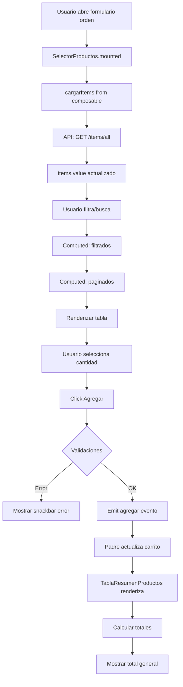

# Componentes de Selección de Productos - Documentación

**Fecha de actualización:** 30 de diciembre de 2025  
**Sistema:** ServiCopias - Módulo de Órdenes  
**Framework:** Vue 3 (Composition API) + Vuetify 3

---

## 📋 Arquitectura de Componentes

### Estructura
```
Frontend/src/components/
├── ordenes/
│   ├── SelectorProductos.vue       # Selector visual de productos
│   └── TablaResumenProductos.vue   # Carrito de compra/resumen
└── composables/
    └── useProductosSelector.js     # Lógica reutilizable
```

---

## 🎣 Composable: useProductosSelector

### Propósito
Composable reutilizable que centraliza toda la lógica de gestión de productos para evitar duplicación de código entre componentes.

### Estado Reactivo

```javascript
{
  // Datos
  items: ref([]),                      // Lista completa de productos
  busqueda: ref(''),                   // Término de búsqueda
  categoriaSeleccionada: ref(null),    // Categoría filtrada
  pagina: ref(1),                      // Página actual
  porPagina: ref(8),                   // Items por página
  cargando: ref(false),                // Estado de carga
  error: ref(null)                     // Mensajes de error
}
```

### Computadas

| Propiedad | Tipo | Descripción |
|-----------|------|-------------|
| `categoriasDisponibles` | `Array<string>` | Lista única de nombres de categorías |
| `filtrados` | `Array<Object>` | Items filtrados por búsqueda y categoría |
| `paginados` | `Array<Object>` | Items de la página actual |
| `totalPaginas` | `Number` | Total de páginas disponibles |

### Métodos Principales

#### `cargarItems()`
Carga todos los productos desde la API.

```javascript
async cargarItems()
// - Marca cargando = true
// - Fetch a /items/all
// - Actualiza items.value
// - Maneja errores
```

#### `cambiarPagina(nuevaPagina)`
Navega entre páginas de resultados.

```javascript
cambiarPagina(nuevaPagina: number)
// Valida que la página esté en rango
// Actualiza pagina.value
```

#### `limpiarFiltros()`
Resetea todos los filtros aplicados.

```javascript
limpiarFiltros()
// busqueda = ''
// categoriaSeleccionada = null
// pagina = 1
```

### Helpers Visuales

#### `getTipoColor(tipo)`
Retorna color según tipo de item.
- `'producto'` → `'blue'`
- `'servicio'` → `'green'`

#### `getTipoIcon(tipo)`
Retorna icono según tipo.
- `'producto'` → `'mdi-package'`
- `'servicio'` → `'mdi-tools'`

#### `getStockColor(stock)`
Retorna color según nivel de stock.
- `null/undefined` → `'grey'`
- `<= 0` → `'error'`
- `< 10` → `'warning'`
- `>= 10` → `'success'`

### Uso del Composable

```vue
<script setup>
import { useProductosSelector } from '../composables/useProductosSelector'

const {
  items,
  busqueda,
  categoriaSeleccionada,
  filtrados,
  paginados,
  totalPaginas,
  cargarItems,
  cambiarPagina,
  limpiarFiltros,
  getTipoColor,
  getTipoIcon,
  getStockColor
} = useProductosSelector()

onMounted(() => {
  cargarItems()
})
</script>
```

---

## 🛒 Componente: SelectorProductos.vue

### Propósito
Componente visual para seleccionar productos y agregarlos al carrito de una orden.

### Características

✅ **Visualización Moderna**
- Card con header gradient (azul)
- Tabla responsive con imágenes de producto
- Chips coloridos para tipo, stock y categoría
- Avatares de producto o placeholders

✅ **Filtros Avanzados**
- Búsqueda por nombre, tipo, código de barras
- Filtro por categoría
- Botón "Limpiar" para resetear filtros

✅ **Estados UI**
- Loading state con spinner
- Error state con alert
- Empty state cuando no hay resultados
- Paginación manual

✅ **Gestión de Cantidad**
- Input numérico por producto
- Validación de stock para productos físicos
- Sin límite para servicios

### Eventos Emitidos

#### `@agregar`
Se emite cuando se agrega un producto al carrito.

**Payload:**
```javascript
{
  itemId: Number,           // ID del producto
  nombre: String,           // Nombre del producto
  cantidad: Number,         // Cantidad seleccionada
  precio_unitario: Number,  // Precio unitario
  subtotal: Number          // cantidad × precio_unitario
}
```

### Validaciones

```javascript
// Cantidad mínima
if (cantidad < 1) {
  error = "⚠️ Cantidad inválida"
}

// Stock disponible (solo productos)
if (tipo === 'producto' && cantidad > stock) {
  error = "⚠️ La cantidad supera el stock disponible"
}
```

### Uso

```vue
<template>
  <SelectorProductos @agregar="agregarAlCarrito" />
</template>

<script setup>
function agregarAlCarrito(producto) {
  carrito.value.push(producto)
  // Calcular totales, etc.
}
</script>
```

---

## 📦 Componente: TablaResumenProductos.vue

### Propósito
Muestra el resumen del carrito con los productos agregados y el total a pagar.

### Características

✅ **Visualización del Carrito**
- Card con header gradient (verde)
- Tabla con numeración de items
- Chips para cantidad
- Formato monetario para precios

✅ **Empty State**
- Icono de carrito vacío
- Mensaje informativo

✅ **Totales Calculados**
- Total de items (suma de cantidades)
- Total general (suma de subtotales)
- Sección destacada con fondo gris

✅ **Acciones**
- Botón para quitar productos del carrito
- Tooltips informativos

### Props

```javascript
{
  items: {
    type: Array,
    default: () => [],
    // Estructura esperada:
    // [{
    //   itemId: Number,
    //   nombre: String,
    //   cantidad: Number,
    //   precio_unitario: Number,
    //   subtotal: Number
    // }]
  }
}
```

### Eventos Emitidos

#### `@quitar`
Se emite cuando se quita un producto del carrito.

**Payload:** `index: Number` - Índice del item en el array

### Computadas

```javascript
const totalItems = computed(() => {
  return props.items.reduce((sum, item) => sum + item.cantidad, 0)
})

const totalGeneral = computed(() => {
  return props.items.reduce((sum, item) => sum + item.subtotal, 0)
})
```

### Uso

```vue
<template>
  <TablaResumenProductos 
    :items="carrito" 
    @quitar="quitarDelCarrito" 
  />
</template>

<script setup>
const carrito = ref([])

function quitarDelCarrito(index) {
  carrito.value.splice(index, 1)
  // Recalcular totales si es necesario
}
</script>
```

---

## 🎨 Estilos y Diseño

### Paleta de Colores

```css
/* Gradientes */
.bg-gradient-primary {
  background: linear-gradient(135deg, #1976d2 0%, #1565c0 100%);
}

.bg-gradient-success {
  background: linear-gradient(135deg, #2e7d32 0%, #1b5e20 100%);
}

/* Chips de tipo */
.tipo-producto { color: blue }
.tipo-servicio { color: green }

/* Chips de stock */
.stock-disponible { color: success }
.stock-bajo { color: warning }
.stock-agotado { color: error }

/* Chips de categoría */
.categoria { color: purple }
```

### Tabla Personalizada

```css
.v-table thead tr th {
  background-color: #f5f5f5;
  font-weight: 600;
  text-transform: uppercase;
  font-size: 0.75rem;
  letter-spacing: 0.5px;
}

.producto-row:hover {
  background-color: #f9f9f9;
}
```

---

## 🔄 Flujo de Trabajo

### Flujo Completo de Selección de Productos



### Integración con Formulario de Orden

```vue
<template>
  <v-form>
    <!-- Datos del cliente -->
    <ClienteForm v-model="cliente" />

    <!-- Selector de productos -->
    <SelectorProductos @agregar="agregarProducto" />

    <!-- Resumen del carrito -->
    <TablaResumenProductos 
      :items="orden.items" 
      @quitar="quitarProducto" 
    />

    <!-- Acciones -->
    <v-btn @click="guardarOrden">Crear Orden</v-btn>
  </v-form>
</template>

<script setup>
import { ref } from 'vue'
import SelectorProductos from '@/components/ordenes/SelectorProductos.vue'
import TablaResumenProductos from '@/components/ordenes/TablaResumenProductos.vue'

const orden = ref({
  items: [],
  total: 0
})

function agregarProducto(producto) {
  orden.value.items.push(producto)
  calcularTotal()
}

function quitarProducto(index) {
  orden.value.items.splice(index, 1)
  calcularTotal()
}

function calcularTotal() {
  orden.value.total = orden.value.items.reduce(
    (sum, item) => sum + item.subtotal, 
    0
  )
}

async function guardarOrden() {
  try {
    await api.post('/ordenes', orden.value)
    // Éxito
  } catch (error) {
    // Manejo de errores
  }
}
</script>
```

---

## ✅ Ventajas de la Arquitectura

### 1. **Reutilización de Código**
- El composable `useProductosSelector` puede usarse en:
  - Formulario de órdenes
  - Módulo de ventas rápidas
  - Cotizaciones
  - Cualquier módulo que necesite seleccionar productos

### 2. **Separación de Responsabilidades**
- **Composable:** Lógica de negocio y estado
- **SelectorProductos:** Presentación y selección
- **TablaResumenProductos:** Resumen y totales

### 3. **Mantenibilidad**
- Cambios en lógica de filtrado → Solo composable
- Cambios en diseño → Solo componentes visuales
- Testing más sencillo (lógica separada de UI)

### 4. **Performance**
- Paginación manual (no carga todos los items en DOM)
- Computadas optimizadas con Vue 3 reactivity
- Lazy loading de imágenes

### 5. **UX Mejorada**
- Estados claros (loading, error, empty)
- Validaciones inmediatas
- Feedback visual (snackbars, chips coloridos)
- Tooltips informativos

---

## 📝 Próximas Mejoras Sugeridas

- [ ] Agregar búsqueda por código de barras con scanner
- [ ] Implementar edición de cantidad directamente en el carrito
- [ ] Agregar botón "Agregar múltiples" para selección batch
- [ ] Integrar descuentos por producto
- [ ] Guardar productos favoritos/frecuentes
- [ ] Agregar vista de grid/cards como alternativa a tabla
- [ ] Implementar drag & drop para reordenar carrito
- [ ] Guardar borrador de carrito en localStorage
- [ ] Agregar botón "Vaciar carrito"
- [ ] Implementar búsqueda con sugerencias (autocomplete)

---

**Última actualización:** 30 de diciembre de 2025  
**Componentes:** SelectorProductos, TablaResumenProductos  
**Composable:** useProductosSelector
